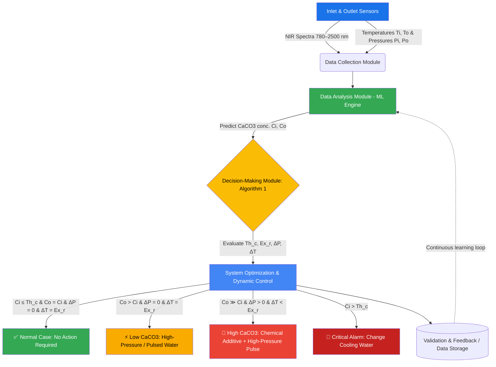
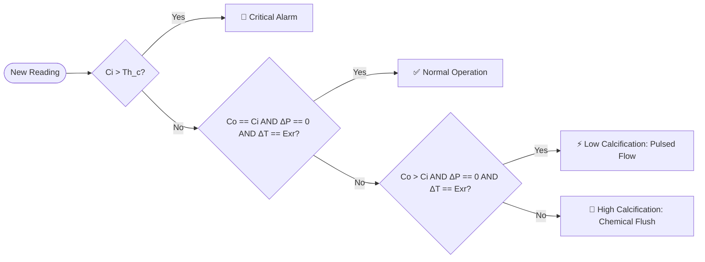

<div align="center">

# 🌊 Smart Predictive Maintenance of Heat Exchangers
### Using AI & Near-Infrared (NIR) Spectroscopy

**A real-time digital twin platform that predicts calcification, prevents fouling, and automates intervention in shell-and-tube heat exchangers.**

[](https://www.python.org/downloads/)
[](https://streamlit.io/)
[](https://xgboost.readthedocs.io/)
[](https://plotly.com/)
[](#-license)
[](https://doi.org/10.11159/ffhmt25.173)
[](#-contributing)

<p>
  <em>An end-to-end digital twin and real-time monitoring platform for shell-and-tube heat exchangers, integrating NIR Spectroscopy (780 nm – 2500 nm) with Machine Learning to predict CaCO₃ concentrations and trigger automated interventions.</em>
</p>

**[Overview](#-1-project-overview) • [Architecture](#-2-system-architecture) • [Features](#-3-core-features--modules) • [Algorithm](#-4-algorithm-1-decision--mitigation-matrix) • [Install](#-5-installation--setup) • [Usage](#-6-usage--dashboard) • [Roadmap](#-7-future-roadmap) • [FAQ](#-9-faq) • [Citation](#-8-citation)

</div>

---

> ### 📄 Based on the research paper
> **"Smart Predictive Maintenance of Heat Exchangers Using AI and Near-Infrared (NIR) Spectroscopy"**
> *Omran Abushammala, Wazen Shbair, Rainier Hreiz, Cécile Lemaitre — FFHMT 2025, Paper No. 173*

---

## 📖 Table of Contents

<details>
<summary><strong>Click to expand full navigation</strong></summary>

1. [Project Overview](#-1-project-overview)
2. [System Architecture](#-2-system-architecture)
3. [Core Features & Modules](#-3-core-features--modules)
4. [Algorithm 1: Decision & Mitigation Matrix](#-4-algorithm-1-decision--mitigation-matrix)
5. [Installation & Setup](#-5-installation--setup)
6. [Usage & Dashboard](#-6-usage--dashboard)
7. [Future Roadmap](#-7-future-roadmap)
8. [Citation](#-8-citation)
9. [FAQ](#-9-faq)
10. [Tech Stack](#-10-tech-stack)
11. [Project Structure](#-11-project-structure)
12. [Contributing](#-12-contributing)
13. [License](#-13-license)

</details>

---

## 🔬 1. Project Overview

Calcification — primarily composed of **calcium carbonate (CaCO₃)** — forms an insulating scale layer on heat exchanger surfaces. This scale silently kills thermal efficiency, spikes energy consumption, and drives up maintenance costs across process industries.

<table>
<tr>
<td width="50%">

**The Problem**
- 🏭 Fouling reduces heat transfer efficiency over time
- 💸 ~**$10 billion/year** in global additional energy & maintenance costs
- 🔧 Traditional detection is manual, reactive, and slow
- ⏱️ Downtime for inspection is costly and disruptive

</td>
<td width="50%">

**The Solution**
- 🔬 Non-invasive **NIR spectral fingerprinting** of flow chemistry
- 🤖 **ML models** (XGBoost / Random Forest) predict CaCO₃ concentration
- 🧠 A rule-based **decision engine** classifies severity in real time
- ⚙️ **Automated control commands** trigger the right intervention, instantly

</td>
</tr>
</table>

> 💡 **In short:** this project turns a heat exchanger into a *self-diagnosing* asset — sensing chemistry, predicting fouling, deciding what to do, and acting, all without waiting for a human to notice a drop in performance.

---

## 🏗️ 2. System Architecture

The platform follows a closed-loop **sense → predict → decide → act → validate** pipeline.



<details>
<summary><strong>🔎 What each module actually does (click to expand)</strong></summary>

| Module | Responsibility |
|---|---|
| **Data Collection** | Streams live NIR spectra + temperature/pressure readings from inlet & outlet sensors |
| **Data Analysis (ML Engine)** | Runs trained regression models to estimate CaCO₃ concentration from spectral features |
| **Decision-Making Engine** | Applies **Algorithm 1** to classify the operating state and select an intervention |
| **System Optimization** | Converts the decision into a dynamic control signal (flow rate, chemical dosing, alarms) |
| **Validation & Feedback** | Logs outcomes and feeds them back to improve model accuracy over time |

</details>

---

## ⚙️ 3. Core Features & Modules

<table>
<tr><td>🛰️</td><td><strong>Data Collection</strong></td><td>Periodic acquisition from NIR spectroscopy sensors alongside temperature and pressure sensors, capturing the chemical composition and thermal state of both inlet and outlet flows.</td></tr>
<tr><td>🧪</td><td><strong>Data Analysis</strong></td><td>ML models trained on spectral signatures to recognize calcification patterns and predict fouling risk before it becomes critical.</td></tr>
<tr><td>🧭</td><td><strong>Decision-Making</strong></td><td>Turns predictions into actionable recommendations via Algorithm 1 — optimized cleaning schedules and targeted, severity-matched interventions.</td></tr>
<tr><td>🎛️</td><td><strong>System Optimization</strong></td><td>Translates recommendations into live dynamic control orders (e.g., adjusting coolant flow rate) to keep performance at peak.</td></tr>
</table>

### ✨ Dashboard Highlights

| Capability | Description |
|---|---|
| 🎚️ **Parameter Sliders** | Manually adjust inlet/outlet temperature & pressure to simulate system stress scenarios |
| 📈 **Live Spectral Graph** | Real-time Plotly visualization comparing inlet vs. outlet NIR absorbance spectra |
| 🚦 **Status Banner** | Dynamic state indicator — flips between *Normal*, *Low Calcification*, *High Calcification*, and *Critical Alarm* |
| 🔄 **One-Command Launch** | Synthetic data generation, model training, and dashboard boot — all from a single command |

---

## 📋 4. Algorithm 1: Decision & Mitigation Matrix

The `decision_engine` implements the exact logic described in the paper to trigger predictive interventions based on four monitored variables:

- **Cᵢ** — Inlet CaCO₃ concentration
- **Cₒ** — Outlet CaCO₃ concentration
- **ΔP** — Pressure drop across the exchanger
- **ΔT** — Delta temperature vs. the expected reference (**Exᵣ**)
- **Thᶜ** — Critical concentration threshold

<div align="center">

| Condition State | Cᵢ (Inlet) | Cₒ (Outlet) | ΔP | ΔT | Dynamic Control Command |
|:---:|:---:|:---:|:---:|:---:|:---|
| 🚨 **Critical Inlet** | `> Thᶜ` | Any | Any | Any | **Alarm** → Change the cooling water immediately |
| ✅ **Normal Operation** | `≤ Thᶜ` | `= Cᵢ` | `= 0` | `= Exᵣ` | **Normal** → No action required |
| ⚡ **Low Calcification** | `≤ Thᶜ` | `> Cᵢ` | `= 0` | `= Exᵣ` | **Pulsed Flow** → Inject high-pressure / pulsed cooling water |
| 🛑 **High Calcification** | `≤ Thᶜ` | `≫ Cᵢ` | `> 0` | `< Exᵣ` | **Chemical Flush** → Add & mix chemical additive + high-pressure injection |

</div>

<details>
<summary><strong>🧠 Simplified decision flow (click to expand)</strong></summary>



</details>

---

## 🚀 5. Installation & Setup

> **Prerequisites:** Python 3.10+

### Step 1 — Clone the Repository
```bash
git clone https://github.com/your-username/smart-heat-exchanger-nir-ai.git
cd smart-heat-exchanger-nir-ai
```

### Step 2 — Create & Activate a Virtual Environment
```bash
python -m venv venv

# macOS / Linux
source venv/bin/activate

# Windows
venv\Scripts\activate
```

### Step 3 — Install Dependencies
Create a `requirements.txt` file:
```text
numpy>=1.24.0
pandas>=2.0.0
scikit-learn>=1.2.0
xgboost>=1.7.0
streamlit>=1.30.0
plotly>=5.15.0
joblib>=1.3.0
```

Then install:
```bash
pip install -r requirements.txt
```

<details>
<summary>⚠️ <strong>Troubleshooting common install issues</strong></summary>

| Issue | Fix |
|---|---|
| `xgboost` build fails on ARM/Mac | Install via `pip install xgboost --only-binary :all:` |
| Streamlit port already in use | Run `streamlit run app.py --server.port 8502` |
| Virtual env not activating on Windows | Use PowerShell and run `Set-ExecutionPolicy -Scope Process -ExecutionPolicy Bypass` first |

</details>

---

## 💻 6. Usage & Dashboard

This project uses a **Unified Application Architecture** — one command generates synthetic data, trains the ML model, and launches the interactive dashboard.

```bash
streamlit run app.py
```

Once launched, open your browser to `http://localhost:8501` and you'll get:

```
┌─────────────────────────────────────────────┐
│   🌊 Heat Exchanger Digital Twin Dashboard   │
├─────────────────────────────────────────────┤
│  🎚️  Ti / To / Pi / Po sliders               │
│  📈  Live NIR spectrum (inlet vs outlet)     │
│  🚦  Status banner: NORMAL / LOW / HIGH /🚨  │
│  🧾  Recommended action + control command    │
└─────────────────────────────────────────────┘
```

**Try it yourself:**
1. Drag the temperature/pressure sliders to simulate stress conditions
2. Watch the live spectral graph update in real time
3. Observe the status banner and recommended action shift according to Algorithm 1
4. Use the feedback log to see how the system "remembers" past states

---

## 🗺️ 7. Future Roadmap

- [x] **System Development** — Build a real-time detection, analysis, and mitigation platform
- [ ] **Laboratory Validation** — Evaluate model accuracy, reliability, and effectiveness at lab scale
- [ ] **Industrial Scaling** — Extend the platform for deployment in full operational environments
- [ ] Integrate live sensor hardware (replace synthetic data generator)
- [ ] Add historical trend analytics & predictive maintenance scheduling
- [ ] Support multi-exchanger fleet monitoring in a single dashboard

---

## 📖 8. Citation

If you use this repository or refer to its underlying methodology, please cite:

```bibtex
@inproceedings{abushammala2025smart,
  title     = {Smart Predictive Maintenance of Heat Exchangers Using AI and Near-Infrared (NIR) Spectroscopy},
  author    = {Abushammala, Omran and Shbair, Wazen and Hreiz, Rainier and Lemaitre, C{\'e}cile},
  booktitle = {Proceedings of the 12th International Conference on Fluid Flow, Heat and Mass Transfer (FFHMT 2025)},
  number    = {173},
  pages     = {173-1--173-9},
  year      = {2025},
  doi       = {10.11159/ffhmt25.173}
}
```

---

## ❓ 9. FAQ

<details>
<summary><strong>Does this repo include real sensor data?</strong></summary>
<br>
No — the current version generates <strong>synthetic data</strong> for demonstration and testing. Real NIR sensor integration is on the roadmap.
</details>

<details>
<summary><strong>Which ML models are supported?</strong></summary>
<br>
The pipeline is built around <strong>XGBoost</strong> and <strong>Random Forest</strong> regressors, chosen for their strong performance on tabular spectral data.
</details>

<details>
<summary><strong>Can I plug in my own NIR spectrometer?</strong></summary>
<br>
Yes — swap the synthetic data generator in the Data Collection module with your sensor's data stream, keeping the same feature schema (spectra + Ti, To, Pi, Po).
</details>

<details>
<summary><strong>What does "Exᵣ" mean in the decision matrix?</strong></summary>
<br>
<code>Exᵣ</code> is the <strong>expected reference delta-temperature</strong> — the ΔT value the system should see under clean, non-fouled conditions.
</details>

---

## 🧰 10. Tech Stack

<div align="center">

| Layer | Technology |
|---|---|
| **Language** | Python 3.10+ |
| **ML Models** | XGBoost, scikit-learn (Random Forest) |
| **Dashboard/UI** | Streamlit |
| **Visualization** | Plotly |
| **Data Handling** | Pandas, NumPy |
| **Persistence** | Joblib |

</div>

---

## 📂 11. Project Structure

```
smart-heat-exchanger-nir-ai/
├── app.py                  # Unified entry point: data gen + training + dashboard
├── requirements.txt        # Python dependencies
├── src/
│   ├── data_collection.py  # Synthetic/real NIR & sensor data generation
│   ├── ml_engine.py        # Model training & CaCO3 prediction
│   ├── decision_engine.py  # Algorithm 1: decision & mitigation logic
│   └── control.py          # Dynamic control command execution
├── models/                 # Saved/trained model artifacts (.pkl)
├── data/                   # Synthetic or logged sensor datasets
└── README.md
```

---

## 🤝 12. Contributing

Contributions are welcome! To contribute:

1. 🍴 Fork the repository
2. 🌿 Create a feature branch (`git checkout -b feature/amazing-feature`)
3. 💾 Commit your changes (`git commit -m 'Add amazing feature'`)
4. 🚀 Push to the branch (`git push origin feature/amazing-feature`)
5. 🔁 Open a Pull Request

---

## 📜 13. License

This project is licensed under the **MIT License** — feel free to use, modify, and distribute with attribution.

---

<div align="center">

**Built with 🧪 spectroscopy, 🤖 machine learning, and a passion for cleaner, more efficient industrial systems.**

⭐ If this project helped you, consider giving it a star!

</div>
